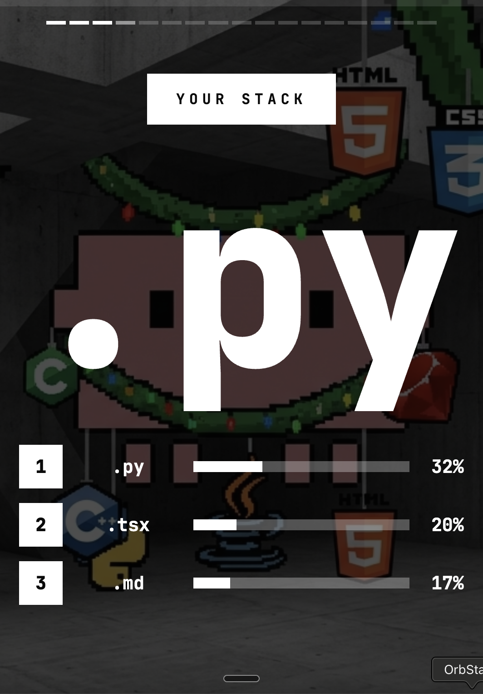
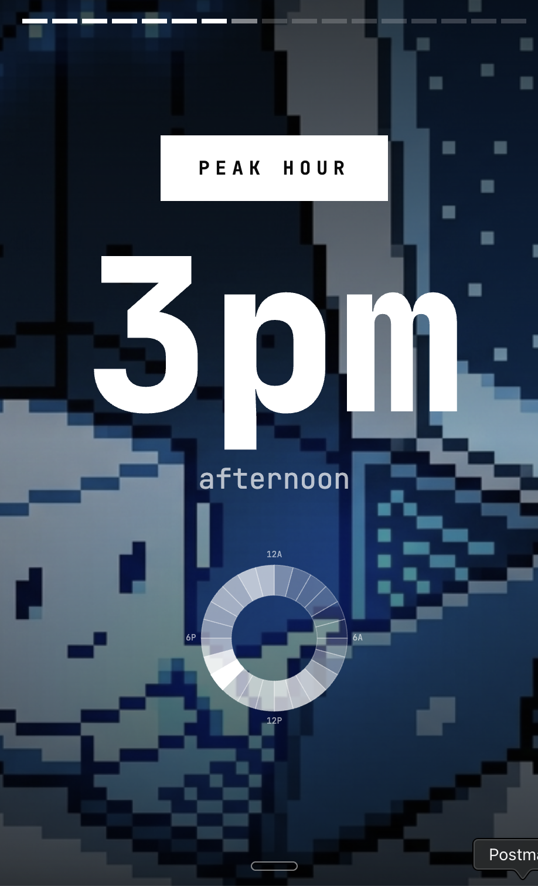
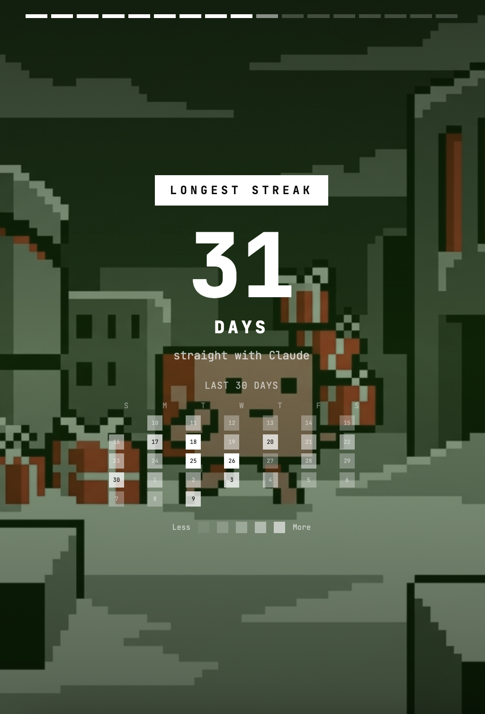
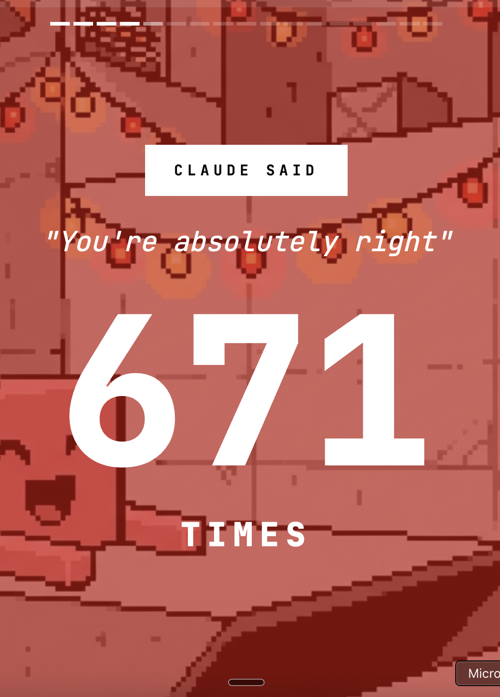
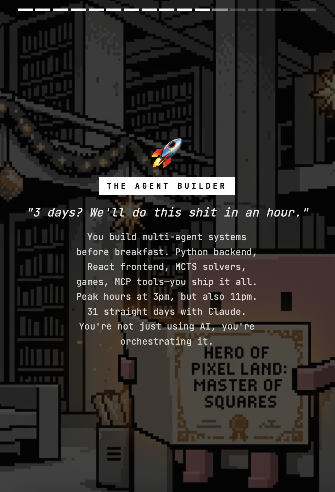

# 2025 Compiled

Spotify Wrapped, but for Claude Code.

Made by **Miguel @ [Parcha.ai](https://parcha.ai)** — props to [Abe Diaz](https://www.linkedin.com/in/abediaz/) for the idea.

## Install

```bash
/plugin marketplace add miguelrios/2025-compiled
/plugin install 2025-compiled
```

## Run

```bash
/2025-compiled:generate
```

## What You Get

Brutalist Instagram Stories showing your year:

- Total prompts, lines written, files created
- "You're absolutely right" count (yes, we track that)
- Peak hours (24-hour clock heatmap)
- Language breakdown
- Your persona, roast, and hype - all generated by Claude based on your actual prompts

## Privacy

100% local. Reads your `.claude` directory, processes locally, outputs HTML to disk. Your conversation data goes to Anthropic (same as normal Claude Code usage) but nowhere else.

## Sharing

You get a URL like `https://blog.parcha.dev/static/2025-compiled-shared?d=H4sIAAAA...`

Your data is gzip'd and base64'd directly into the URL. The `?d=` param IS your data. The hosted page is just static HTML that decodes whatever's in the URL - no backend, no database, no storage. Long URLs, but zero server trust.

## Verify

All commits are GPG signed. You can also verify checksums:

```bash
git clone https://github.com/miguelrios/2025-compiled.git
cd 2025-compiled
./verify.sh
```

## Screenshots








## Tech

Bun, TypeScript, Zod.

## License

MIT
